## Nutch爬虫配置及简单使用

### 1 引言
#### 1.1 爬虫的基本分类
爬虫基本可以分3类：
- 分布式爬虫：Nutch
- JAVA单机爬虫：Crawler4j、WebMagic、WebCollector
- 非JAVA单机爬虫：Scrapy

#### 1.2 Nutch简介
Nutch是apache旗下的一个用Java实现的开源索引引擎项目，通过nutch，诞生了hadoop、tika、gora。Nutch的设计初衷主要是为了解决下述两个问题：

- **商业搜索引擎存在商业利益的考虑。** 有的商业搜索引擎允许竞价排名(比如百度)，搜索结果不是纯粹的根据网页本身的价值进行排序，这样有的搜索结果不全是和站点内容相关。
- **商业搜索引擎不开源。** Nutch是开放源代码，因此任何人都可以查看它的排序算法是如何工作的。Nutch对学术搜索和政府类站点的搜索来说是个好选择。因为一个公平的排序结果是非常重要的。

#### 1.3 Nutch的版本
Nutch1.2版本之后，Nutch已经从搜索引擎演化为网络爬虫，演化为两大分支版本：1.X和2.X，最大区别在于2.X对底层的数据存储进行了抽象以支持各种底层存储技术，其中：
- Nutch1.2之后是一个完整的搜索引擎
- Nutch1.7之后是一个基于HDFS的网络爬虫
- Nutch2.2.1之后是一个基于Gora的网络爬虫

### 2 环境搭建与配置
#### 2.1 环境和工具
Nutch的编译安装需要JDK、Ant等环境，为此本次使用的环境和工具如下：
- 1、操作系统：Ubuntu 16.04 LTS 64位
- 2、JDK版本: JDK1.8.0_161
- 3、Nutch版本：nutch-1.9（源码）
- 4、IDE：Eclipse

##### 2.1.1 JDK配置
本次JDK使用1.8.0_161，在Oracle官网http://www.oracle.com/technetwork/java/javase/downloads/index.html 可以下载

首次使用需要设置环境变量，在```~/.bashrc```的末尾加入以下内容：
```
#set jdk environment
export JAVA_HOME=/java/jdk1.8.0_161
export JRE_HOME=$JAVA_HOME/jre
export CLASSPATH=.:$JAVA_HOME/lib:$JRE_HOME/lib:$CLASSPATH
export PATH=$JAVA_HOME/bin:$JRE_HOME/bin:$PATH
```

然后使用```source ~/.bashrc```命令使得环境变量生效。

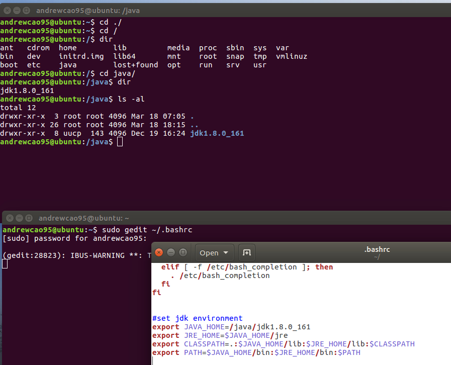
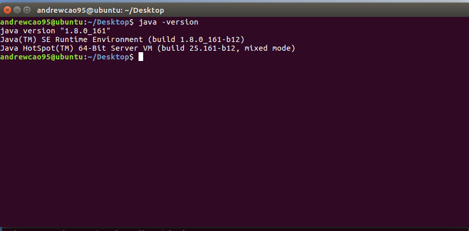

##### 2.1.2 Nutch源码下载
Nutch分为bin和src，bin是运行包、src是源码包，本次我们使用nutch-1.9源码包自己编译，推荐使用SVN进行安装，SVN checkout出来的有pom.xml文件，即maven文件。

```
$ sudo apt install subversion
$ svn co https://svn.apache.org/repos/asf/nutch/tags/release-1.9
```
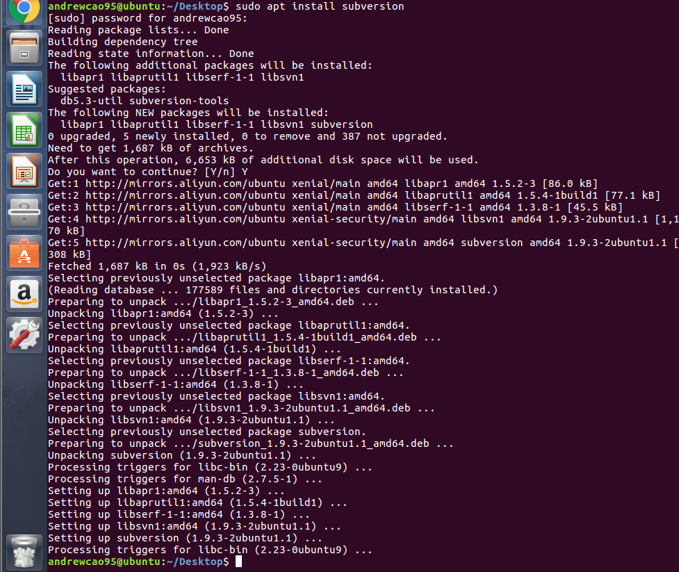

##### 2.1.3 安装Ant
到Ant官网 http://ant.apache.org/bindownload.cgi 下载最新版的Ant。


同样也需要设置环境变量
```
#set ant environment
export ANT_HOME=/ant/ant-1.9.10
export PATH=$PATH:$ANT_HOME/bin
```
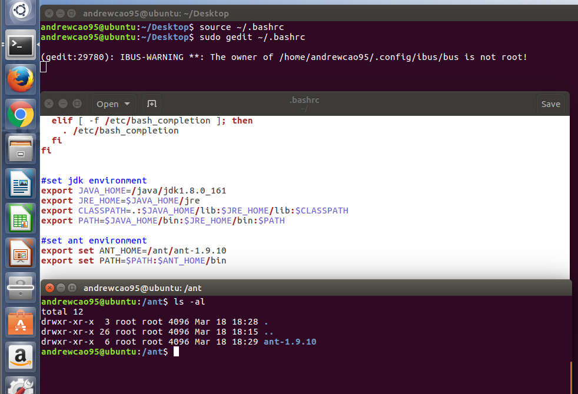


##### 2.1.4 安装IDE
略

#### 2.2 配置
把 conf/下的 nutch-site.xml.template复制一份，命名为nutch-site.xml，在里面添加配置：
```
<property>
  <name>http.agent.name</name>
  <value>My Nutch Spider</value>
</property>
<property>
  <name>plugin.folders</name>
  <value>$NUTCH_HOME/build/plugins</value>
</property>
```
$NUTCH_HOME是指nutch源码的根目录，例如我的是/home/andrewcao95/Desktop/release-1.9

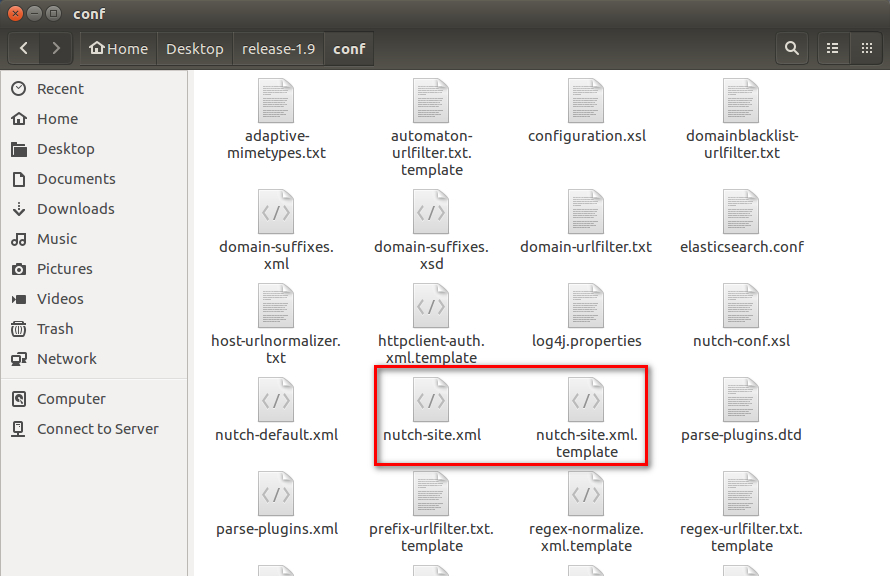
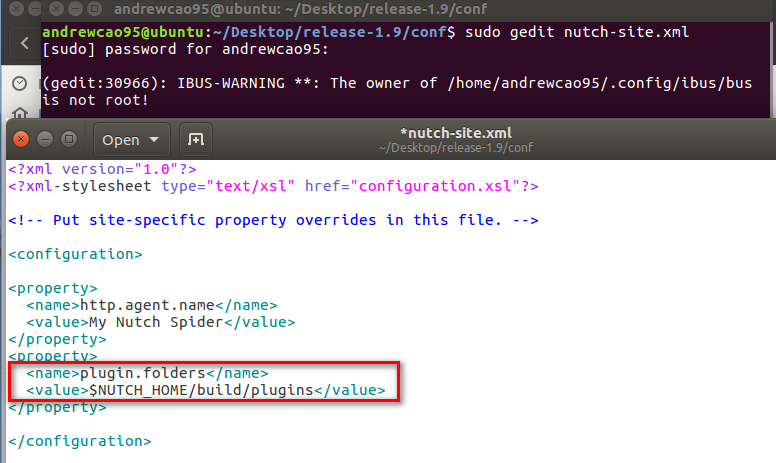


#### 2.3 编译Nutch源码
生成Eclipse项目文件，即.project文件，使用如下命令

```
ant eclipse
```
耐心等待，这个过程ant会根据ivy从中心仓库下载各种依赖jar包，可能要几分钟。**这里特别要注意网络通畅，学院的网络可能存在一定的问题，导致很多jar包无法访问，最终会导致编译失败。同时要注意原来的配置文件中包的下载地址会发生变化，为此需要根据报错指令进行相对应的调整。**

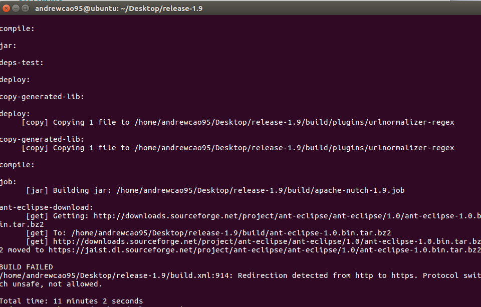
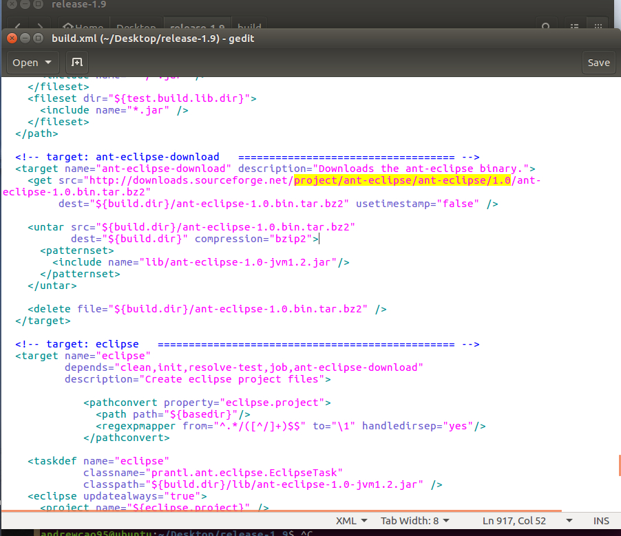

解决了上述问题之后，很快就能编译成功


#### 2.4 导入Nutch到Eclipse

按照[RunNutchInEclipse](https://wiki.apache.org/nutch/RunNutchInEclipse "RunNutchInEclipse")的教程指导，很快就能导入项目。之后我们就能看到Nutch项目的完整源代码

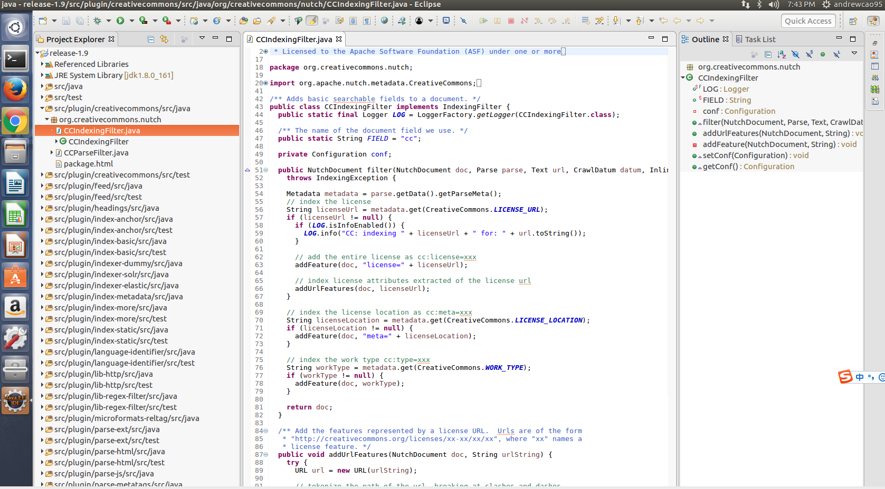

#### 2.5 测试Nutch源码

源码导入工程后，并不能执行完整的爬取。Nutch将爬取的流程切分成很多阶段，每个阶段分别封装在一个类的main函数中。我们首先运行Nutch中最简单的流程：Inject。

我们知道爬虫在初始阶段是需要人工给出一个或多个url，作为起始点（广度遍历树的树根）。Inject的作用，就是把用户写在文件里的种子(一行一个url，是TextInputFormat)，插入到爬虫的URL管理文件(crawldb，是SequenceFile)中。


从src文件夹中找到org.apache.nutch.crawl.Injector类，可以看到,main函数其实是利用ToolRunner，执行了run(String[] args)。这里ToolRunner.run会从第二个参数(new Injector())这个对象中，找到run(String[] args)这个方法执行。从run方法中可以看出来，String[] args需要有2个参数，第一个参数表示爬虫的URL管理文件夹(输出），第二个参数表示种子文件夹（输入）。对hadoop中的map reduce程序来说，输入文件夹是必须存在的，输出文件夹应该不存在。我们创建一个文件夹 urls，来存放种子文件（作为输入）。在seed.txt中加入一个种子URL。

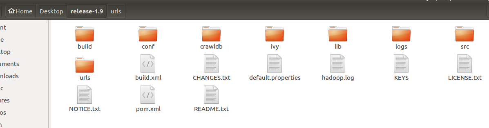
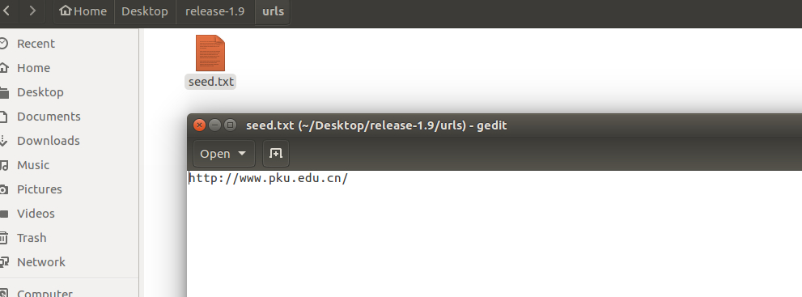

指定一个文件夹crawldb来作为URL管理文件夹（输出）。有一种简单的方法来指定args，直接在main函数下加一行：
```
args=new String[]{"/home/andrewcao95/Desktop/release-1.9/crawldb","/home/andrewcao95/Desktop/release-1.9/urls"};
```
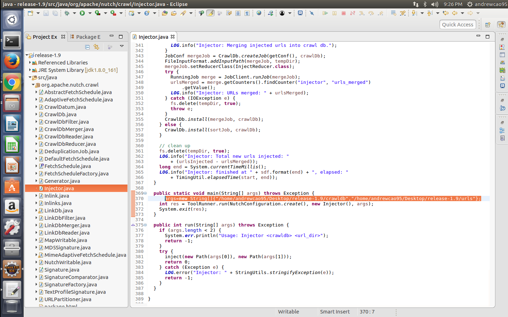

运行该类，可以看到运行成功。

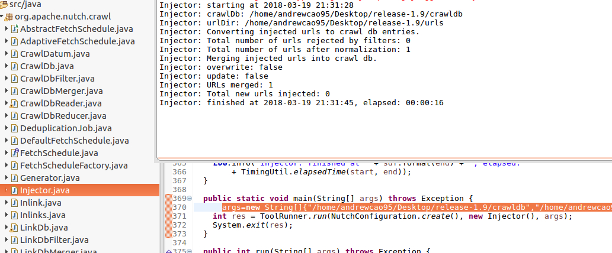

读取爬虫文件：

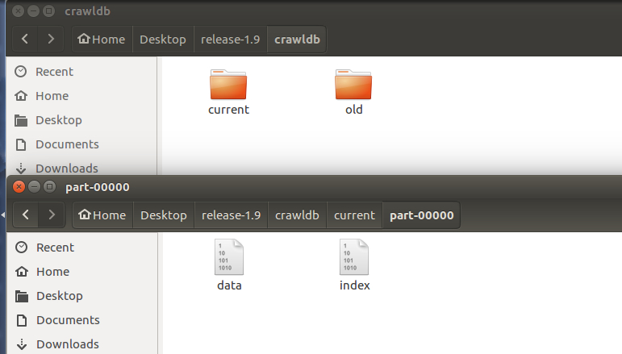

查看里面的data文件
```
vim /home/andrewcao95/Desktop/release-1.9/crawldb/current/part-00000/data  
```
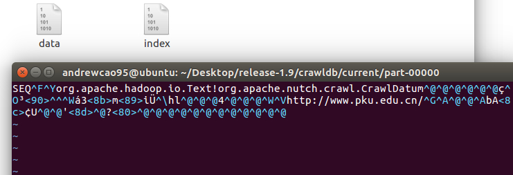

这是一个SequenceFile，Nutch中除了Inject的输入（种子）之外，其他文件全部以SequenceFile的形式存储。SequenceFile的结构如下：
```
key0 value0  
key1 value1  
key2  value2  
......  
keyn  valuen
```
以key value的形式，将对象序列（key value序列）存储到文件中。我们从SequenceFile头部可以看出来key value的类型。

上面的SequenceFile中，可以看出key的类型是org.apache.hadoop.io.Text，value的类型是org.apache.nutch.crawl.CrawlDatum。


### 3 爬虫爬取过程分析
#### 3.1 分析爬虫文件

首先我们需要读取SequenceFile的代码，在src/java里新建一个类org.apache.nutch.example.InjectorReader，代码如下：
```java
package org.apache.nutch.example;  

import org.apache.hadoop.conf.Configuration;  
import org.apache.hadoop.fs.FileSystem;  
import org.apache.hadoop.fs.Path;  
import org.apache.hadoop.io.SequenceFile;  
import org.apache.hadoop.io.Text;  
import org.apache.nutch.crawl.CrawlDatum;  

import java.io.IOException;  

public class InjectorReader {  
    public static void main(String[] args) throws IOException {  
        Configuration conf=new Configuration();  
        Path dataPath=new Path("/home/andrewcao95/Desktop/release-1.9/crawldb/current/part-00000/data");  
        FileSystem fs=dataPath.getFileSystem(conf);  
        SequenceFile.Reader reader=new SequenceFile.Reader(fs,dataPath,conf);  
        Text key=new Text();  
        CrawlDatum value=new CrawlDatum();  
        while(reader.next(key,value)){  
            System.out.println("key:"+key);  
            System.out.println("value:"+value);  
        }  
        reader.close();  
    }  
}  
```

得到的运行结果如图所示：

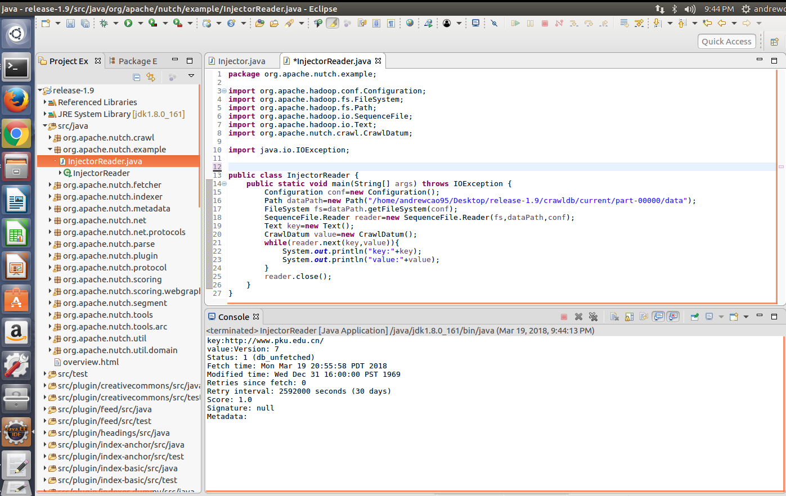

我们可以看到，程序读出了刚才Inject到crawldb的url，key是url，value是一个CrawlDatum对象，这个对象用来维护爬虫的URL管理信息，我们可以看到一行``` Status: 1 (db_unfetched)  ``` ，这表示表示当前url为未爬取状态，在后续流程中，爬虫会从crawldb取未爬取的url进行爬取。

#### 3.2 一次完整的爬虫爬取过程
在爬取之前，我们先修改一下conf/nutch-default.xml中的一个地方,这个值会在发送http请求时，作为User-Agent字段。

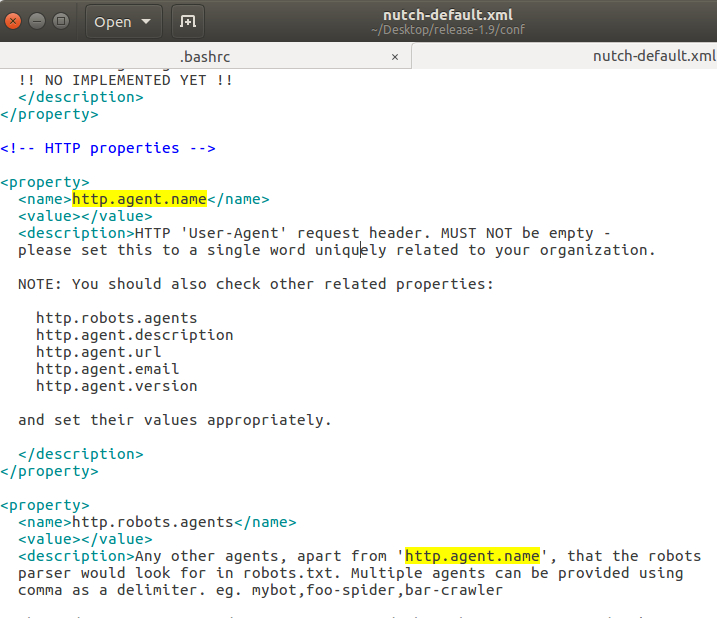
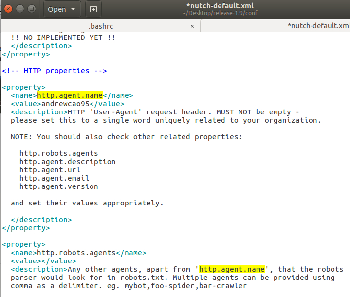

在org.apache.nutch.crawl中新建一个Crawl.java文件，代码如下所示

```java
package org.apache.nutch.crawl;  

import java.util.*;  
import java.text.*;  
import org.apache.commons.lang.StringUtils;  
import org.slf4j.Logger;  
import org.slf4j.LoggerFactory;  
import org.apache.hadoop.fs.*;  
import org.apache.hadoop.conf.*;  
import org.apache.hadoop.mapred.*;  
import org.apache.hadoop.util.Tool;  
import org.apache.hadoop.util.ToolRunner;  
import org.apache.nutch.parse.ParseSegment;  
import org.apache.nutch.indexer.IndexingJob;   
import org.apache.nutch.util.HadoopFSUtil;  
import org.apache.nutch.util.NutchConfiguration;  
import org.apache.nutch.util.NutchJob;  

import org.apache.nutch.fetcher.Fetcher;  

public class Crawl extends Configured implements Tool {  
    public static final Logger LOG = LoggerFactory.getLogger(Crawl.class);  

    private static String getDate() {  
        return new SimpleDateFormat("yyyyMMddHHmmss").format  
                (new Date(System.currentTimeMillis()));  
    }  

    public static void main(String args[]) throws Exception {  
        Configuration conf = NutchConfiguration.create();  
        int res = ToolRunner.run(conf, new Crawl(), args);  
        System.exit(res);  
    }  

    @Override  
    public int run(String[] args) throws Exception {  
        /*种子所在文件夹*/  
        Path rootUrlDir = new Path("/home/andrewcao95/Desktop/release-1.9/urls");  
        /*存储爬取信息的文件夹*/  
        Path dir = new Path("/home/andrewcao95/Desktop/release-1.9","crawl-" + getDate());  
        int threads = 50;  
        /*广度遍历时爬取的深度，即广度遍历树的层数*/  
        int depth = 2;  
        long topN = 10;  

        JobConf job = new NutchJob(getConf());  
        FileSystem fs = FileSystem.get(job);  

        if (LOG.isInfoEnabled()) {  
            LOG.info("crawl started in: " + dir);  
            LOG.info("rootUrlDir = " + rootUrlDir);  
            LOG.info("threads = " + threads);  
            LOG.info("depth = " + depth);  
            if (topN != Long.MAX_VALUE)  
                LOG.info("topN = " + topN);  
        }  

        Path crawlDb = new Path(dir + "/crawldb");  
        Path linkDb = new Path(dir + "/linkdb");  
        Path segments = new Path(dir + "/segments");  
        Path indexes = new Path(dir + "/indexes");  
        Path index = new Path(dir + "/index");  

        Path tmpDir = job.getLocalPath("crawl"+Path.SEPARATOR+getDate());  
        Injector injector = new Injector(getConf());  
        Generator generator = new Generator(getConf());  
        Fetcher fetcher = new Fetcher(getConf());  
        ParseSegment parseSegment = new ParseSegment(getConf());  
        CrawlDb crawlDbTool = new CrawlDb(getConf());  
        LinkDb linkDbTool = new LinkDb(getConf());  

        // initialize crawlDb  
        injector.inject(crawlDb, rootUrlDir);  
        int i;  
        for (i = 0; i < depth; i++) {             // generate new segment  
            Path[] segs = generator.generate(crawlDb, segments, -1, topN, System  
                    .currentTimeMillis());  
            if (segs == null) {  
                LOG.info("Stopping at depth=" + i + " - no more URLs to fetch.");  
                break;  
            }  
            fetcher.fetch(segs[0], threads);  // fetch it  
            if (!Fetcher.isParsing(job)) {  
                parseSegment.parse(segs[0]);    // parse it, if needed  
            }  
            crawlDbTool.update(crawlDb, segs, true, true); // update crawldb  
        }  

        if (LOG.isInfoEnabled()) { LOG.info("crawl finished: " + dir); }  
        return 0;  
    }  
}  
```
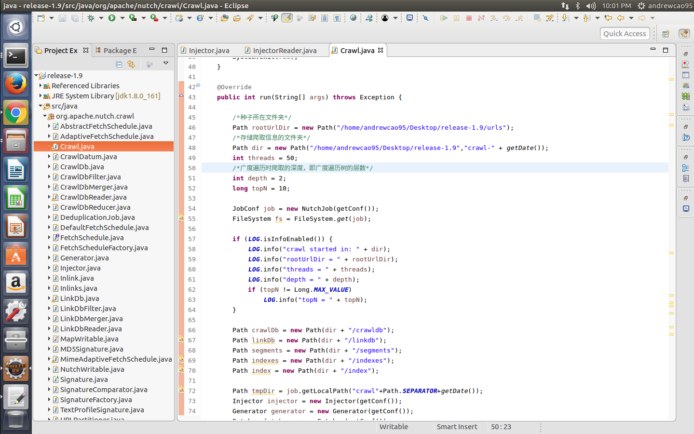

通过上述代码可以执行一次完整的爬取，程序运行结果如下所示：

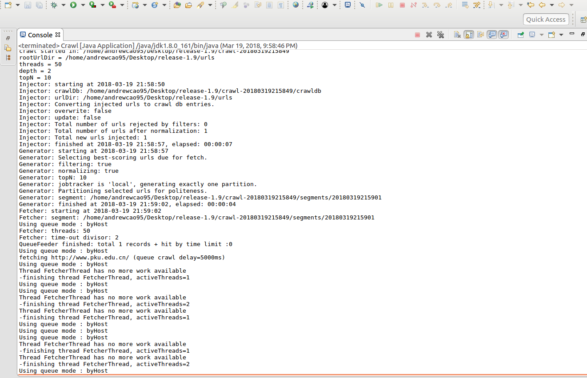
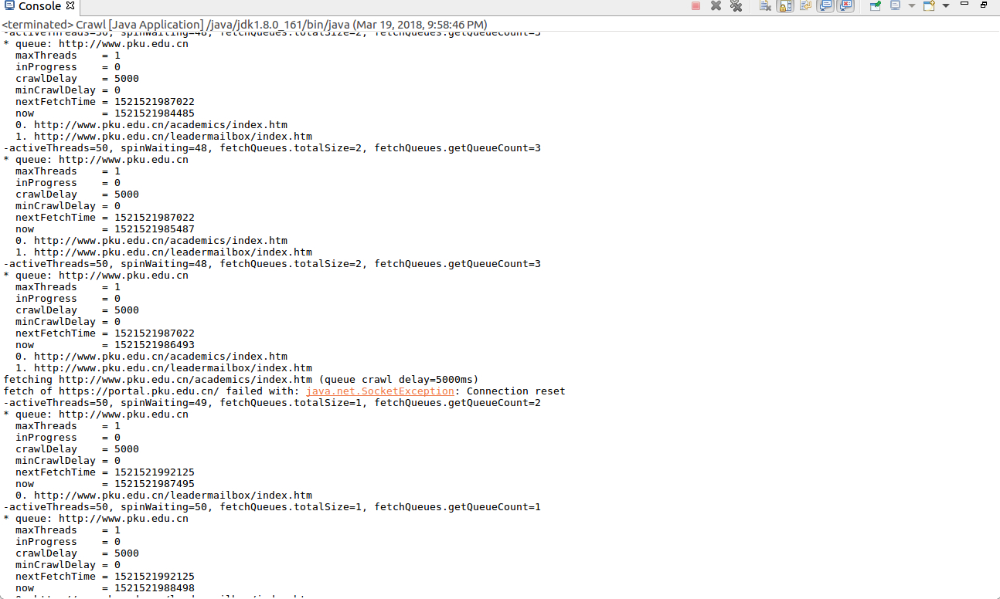
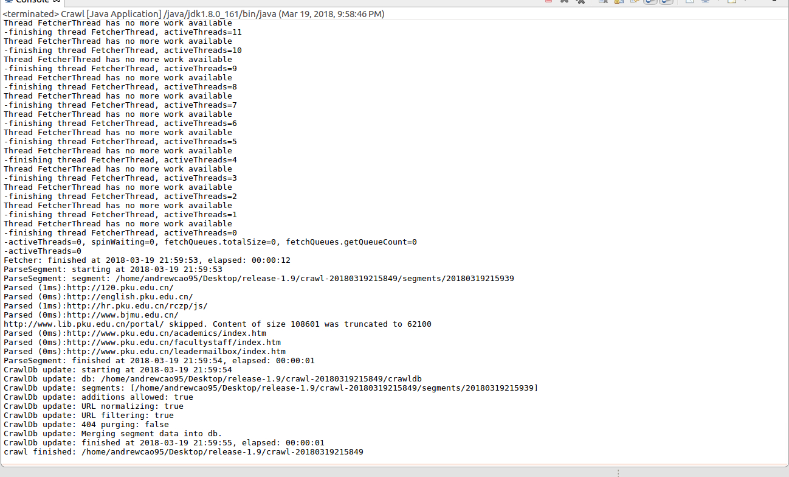

运行成功，对网站（[http://pku.edu.cn/](http://pku.edu.cn/)）进行了2层爬取，爬取信息都保存在/tmp/crawl+时间的文件夹中

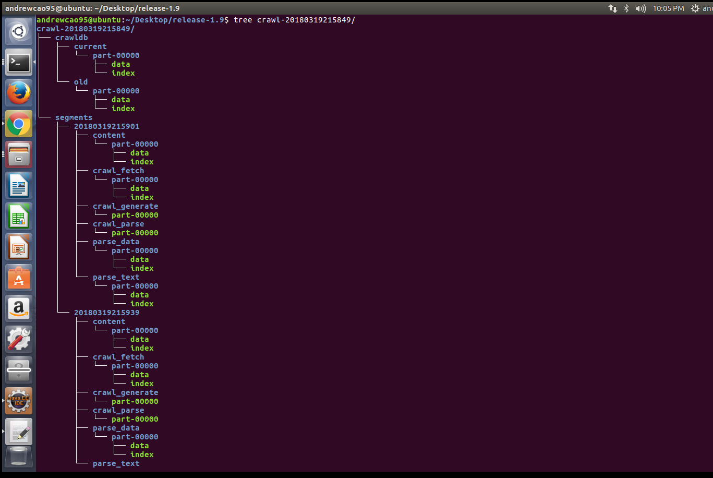

### 参考资料
- https://wiki.apache.org/nutch/NutchTutorial
- http://yukinami.github.io/2016/09/23/Nutch%E7%88%AC%E8%99%AB%E5%BC%80%E5%8F%91/
- http://www.voidcn.com/article/p-gcnehxms-sg.html
- https://wiki.apache.org/nutch/RunNutchInEclipse
- http://datahref.com/archives/41
- http://cn.soulmachine.me/2014-01-20-Running-Nutch-in-Eclipse/
- https://www.kancloud.cn/kancloud/step-by-step-nutch/48722
